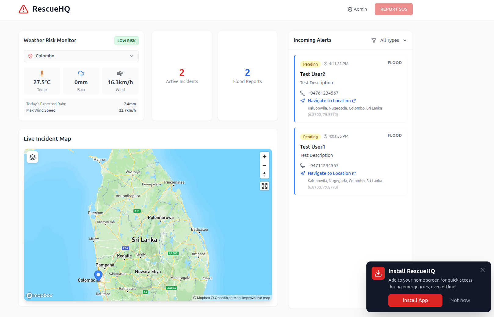
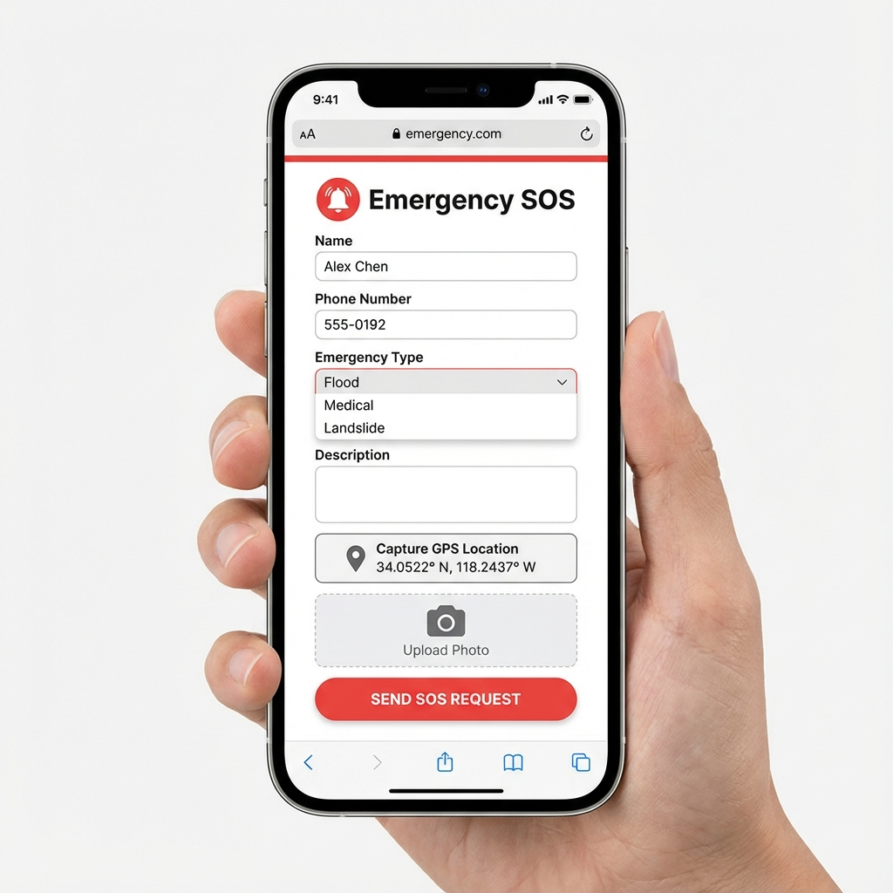

# 🆘 RescueHQ - Disaster Management Platform

  

  <strong>A real-time disaster management and emergency response platform for Sri Lanka</strong>

---

## Screenshots

  
   
  <em>Public Dashboard with Real-time Map & Incident Tracking</em>

  
   
  <em>Emergency SOS Submission Form</em>

---

## Features

### Emergency SOS System
- **Quick SOS Submission** - One-click emergency reporting with GPS location
- **Photo Evidence** - Attach images to reports
- **Reverse Geocoding** - Automatically converts coordinates to human-readable addresses
- **Offline Support** - Queues requests when offline and syncs automatically

### Interactive Map Dashboard
- **Real-time Incident Tracking** - Live markers on Mapbox map
- **Color-coded Markers** - Different colors for flood, medical, landslide emergencies
- **Google Maps Navigation** - Click any marker to get directions
- **Multiple Map Styles** - Streets, Satellite, Outdoors, Dark mode

### Weather & Predictive Alerts
- **Live Weather Data** - Current conditions from Open-Meteo API
- **Risk Level Indicators** - Automatic flood/cyclone risk assessment
- **AI-Powered Predictions** - Gemini AI analyzes weather patterns (optional)
- **Alert Banner** - Prominent warnings when severe weather detected

### Admin Panel
- **Secure Login** - Firebase Authentication for admin access
- **Incident Management** - Update status (Pending → In Progress → Completed)
- **Filtering & Search** - Find incidents by status, type, or keywords
- **Real-time Updates** - Live data sync across all connected devices

### Progressive Web App (PWA)
- **Installable** - Add to home screen on any device
- **Works Offline** - Service worker caches critical resources
- **Push Notifications** - (Ready for implementation)
- **Responsive Design** - Works on mobile, tablet, and desktop

### SMS Notifications (Cloud Functions)
- **Automatic Alerts** - Notify rescue teams when new SOS received
- **Status Updates** - Victims get SMS when rescue is dispatched
- **Powered by Twilio** - Reliable delivery worldwide

---

## Tech Stack

| Category | Technology |
|----------|------------|
| **Frontend** | React 18, Vite, Tailwind CSS |
| **Backend** | Firebase (Firestore, Auth, Storage, Cloud Functions) |
| **Maps** | Mapbox GL JS |
| **Weather** | Open-Meteo API |
| **AI** | Google Gemini API |
| **SMS** | Twilio |
| **Icons** | Lucide React |
| **PWA** | vite-plugin-pwa, Workbox |

---

## Usage

### Submitting an SOS Request
1. Click **"SOS"** button on the dashboard
2. Fill in your **name** and **phone number**
3. Select **emergency type** (Flood, Medical, Landslide, Trapped)
4. Click **"Capture GPS Location"**
5. Add a **description** and optional photo
6. Click **"Send SOS Request"**

### Admin Panel
1. Navigate to `/admin/login`
2. Login with admin credentials
3. View and manage all incidents
4. Update status as rescue progresses

### Installing as PWA
1. Visit the app in Chrome/Edge
2. Click "Install App" banner or browser install icon
3. App will be added to your home screen

---

##Future Enhancements

- [ ] Real-time chat between victims and rescuers
- [ ] Flood layer visualization with river data
- [ ] Multi-language support (Sinhala, Tamil, English)
- [ ] Integration with DMC (Disaster Management Center) APIs
- [ ] Volunteer registration and dispatch
- [ ] Resource inventory management

---

## Contributing

Contributions are welcome! Please feel free to submit a Pull Request.

---

## License

This project is licensed under the MIT License.

---

## Acknowledgments

- [Mapbox](https://www.mapbox.com/) for mapping services
- [Open-Meteo](https://open-meteo.com/) for weather data
- [Firebase](https://firebase.google.com/) for backend services
- [Twilio](https://www.twilio.com/) for SMS capabilities
- [Google Gemini](https://ai.google.dev/) for AI predictions

---

  Made with ❤️ for Sri Lanka's disaster resilience

